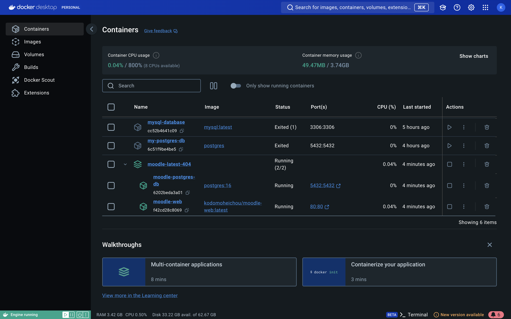
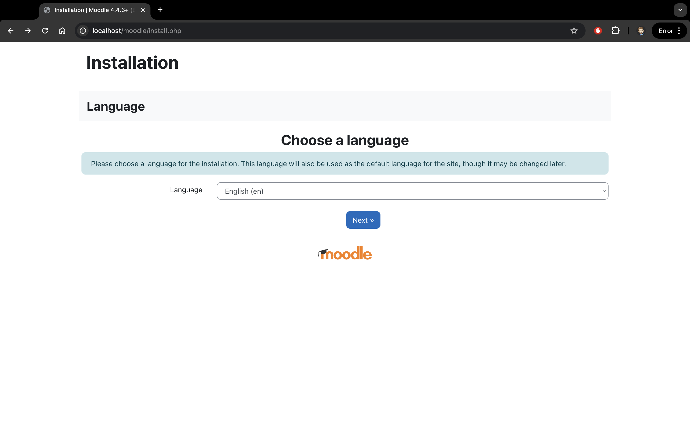
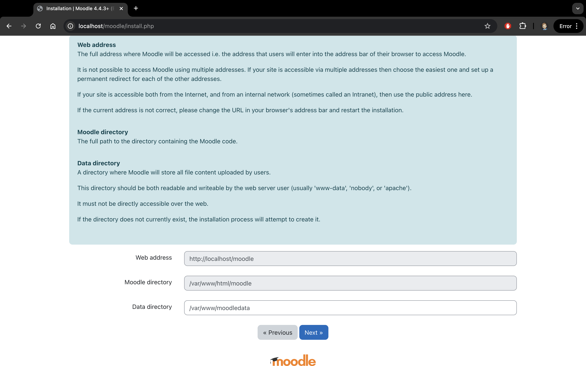
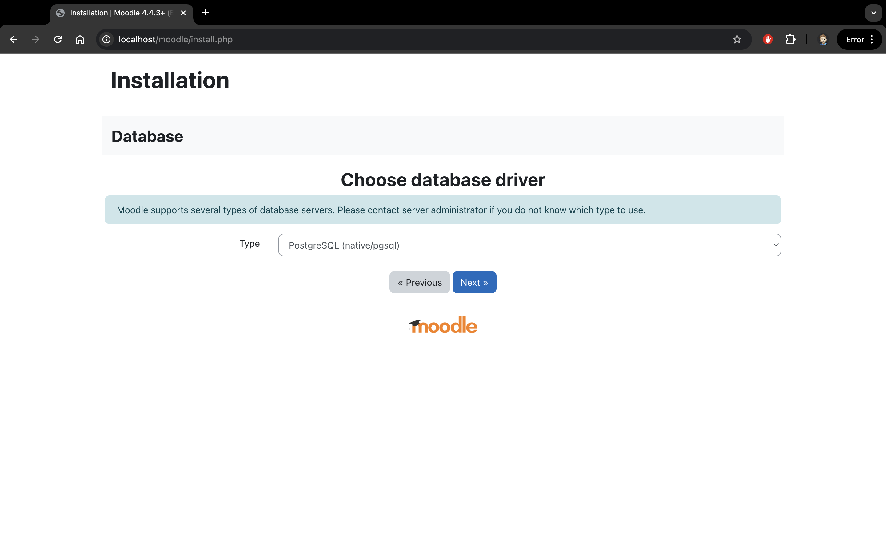
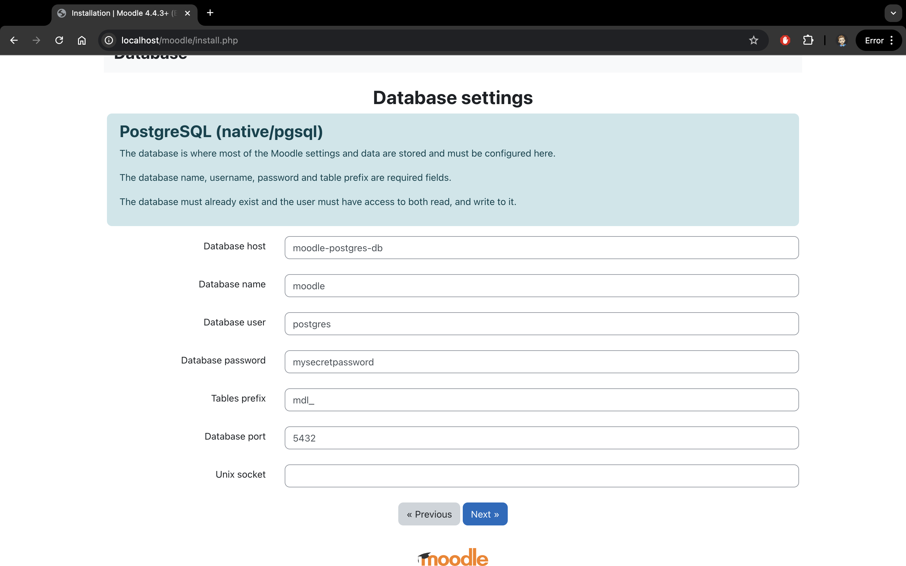

This guide requires docker desktop to be installed \
After installation make sure it is open and working \

Go into this directory with a terminal and run the following command:

```bash
docker-compose up
```

After this two containers should be running


\
\


Then go to link : http://localhost/moodle/index.php \
and you should se the following:

Then click next and you should see the following:

Then click next and you should see the following:

Select postgres and click next and you should see the following:

input the following values:
```
Database host: moodle-postgres-db
Database port: 5432
Database name: moodle
Database user: postgres
Database password: mysecretpassword
Tables prefix: mdl_
Unix-Socket: should be empty
```
More setup will follow but will be dependent on need
